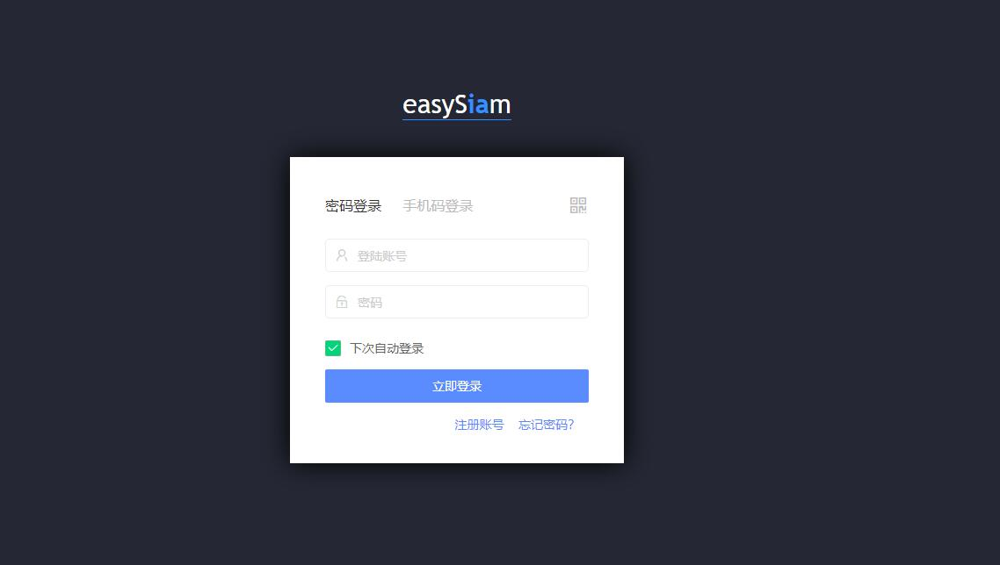
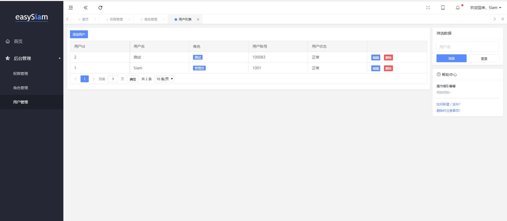
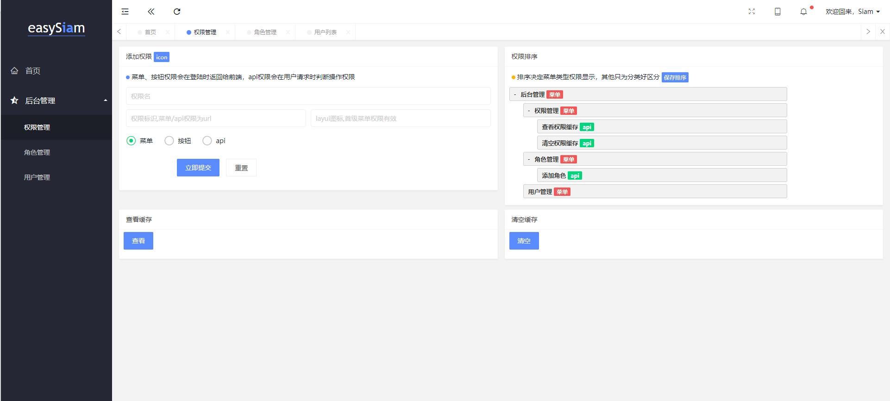

# easyswoole_admin部署教程

在github上切换tag 到1.0版本  下载zip  或者git clone checkout指定tag

正在改版更新2.0  使用ORM组件。请勿直接拉取master

① 上传源码  composer install 

② 开设网站  指向目录 public目录 纯静态 不加载php

③ es安装 (参照es文档安装章节  建议先行运行过hello world 文档过一遍 再尝试本项目) 修改dev.php mysql配置  

④ 导入mysql结构数据  在public目录下的sql文件

⑤ public/nepadmin/config.js搜索 requestUrl  请求url换成你自己的es服务地址  IP:Port

⑥ EasySwooleEvent.php  106行 设置跨域  填写加入 第二步开设的域名（如果为`*` 则允许所有跨域 不需更改）

⑦ 管理员账号 1001 123456   测试账号 100083 123456   可以看到测试账号的菜单只有权限管理，点击查看缓存、清除缓存会提示没有权限  （页面权限和接口权限是两回事）

⑧ layui调试模式  在public/index.html 
```
 // version: Date.parse(new Date()),
 debug: false
 ```

# 作者

Siam - 宣言 - QQ 59419979

可以在easyswoole 1群、2群(管理员)找到俺

# 截图演示





# 权限控制dom
在权限页面有三个按钮
```html

<button class="layui-btn" data-siam-auth="!testtets">没有testtets权限则显示</button>
<button class="layui-btn" data-siam-auth="/api/*">有/api/*权限则显示</button>
<button class="layui-btn" data-siam-auth="/admin/*">有/admin/*权限则显示</button>
```

在dom中使用 data-siam-auth='规则名'  视图显示时候则可自动移除没权限的dom

也可以手动调用验证
```javascript
// 手动调用验证权限
if ( layui.siam.vifAuth('/api/system/clearCache')){
    layer.msg('有/api/system/clearCache的权限');
}else{
    layer.msg('没有/api/system/clearCache的权限');
}
```
